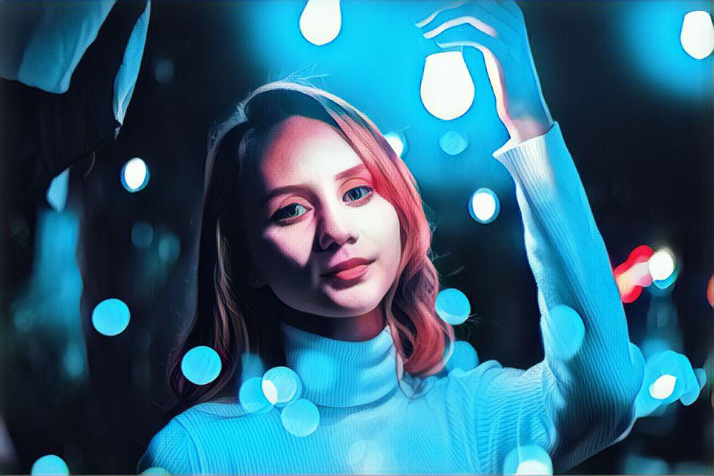

### Simple implementation of Vinci Api

Transform your photos using of neural networks from Vinci

Before:

After:

   

***

Create new object

    $vinci = new Vinci();
    
Get list of filters

    $filters = $vinci->filters();
    
Upload image
    
    $path = 'image.jpeg';
    $image = file_get_contents($path);
    
    $file_id = $vinci->upload($image);
    
    
Convert image to art

    $filter_id = $filters['mystic'];
    
    $art = $vinci->download($file_id, $filter_id);
    
    // display given art
    $art = imagecreatefromstring($art);
    header('Content-type: image/jpeg');
    imagejpeg($art);